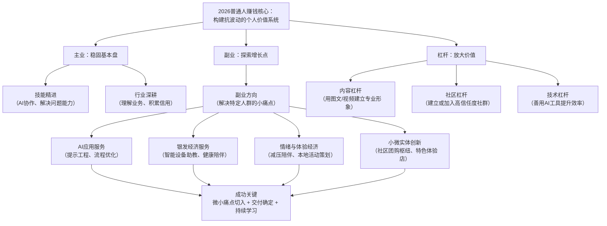

你好！为你规划2026年的赚钱方向，非常明智。普通人想在2026年及未来几年赚钱，核心逻辑不再是寻找一个“躺着赚钱”的风口，而是**构建“抗波动性”的个人价值系统**。

这意味你需要：**主业求稳 + 副业探索 + 杠杆放大**。下图为你梳理了构建个人价值系统的核心框架与关键方向：

以下是结合趋势、风险和可行性的具体分析和行动建议：

### 一、看清2026年的底层趋势（顺势而为）
1.  **AI工具全面渗透**：像用电一样使用AI将成为工作标配。**机会在于**：会用AI为别人解决问题的人。
2.  **“性价比”与“情绪价值”并存**：消费继续分化。人们既追求实用、划算，也愿意为情感共鸣、缓解焦虑付费。
3.  **老龄化与健康意识深化**：为老年人提供便利、健康服务，以及为所有年龄段提供身心健康解决方案，需求持续增长。
4.  **本地化与社区信任经济**：对本地实体和熟人/半熟人社交圈的信任增强，“附近”的生意机会增多。
5.  **灵活就业与“一人企业”模式成熟**：平台、工具和政策让个人更容易以低成本启动小业务。

### 二、重点关注的赚钱方向及切入点（可实操）
基于上图框架，我们重点展开有潜力的副业方向和具体切入点：

#### **方向一：成为“AI赋能师”或“超级个体”
这是对普通人**杠杆最高**的方向。
- **做什么**：
    - **AI工具教学/提示词优化**：教特定行业（如电商、学生、文案、会计）使用AI工具。不是教技术，而是教“如何用AI更快完成你的具体工作”。
    - **小微流程优化服务**：用AI帮小店主优化库存管理、生成营销文案、分析简单数据。
    - **个人AI助理服务**：为忙碌的职场人、创业者提供信息整理、邮件起草、会议纪要生成等服务。
- **你需要**：快速学习能力，以及将复杂工具“翻译”成客户能听懂的语言的能力。

#### **方向二：深耕“银发经济”服务
需求确定，重在耐心和信任。
- **做什么**：
    - **智能设备“助教”**：上门教老年人使用智能手机、网购防骗、预约挂号等。可以按次或包月收费。
    - **健康数据管理助手**：帮助子女管理异地父母的健康数据（血压、血糖等），提供简单的提醒和报告整理。
    - **适老化改造咨询**：与本地家装师傅合作，为家庭提供简单的居家适老化改造建议。
- **你需要**：极大的耐心、良好的沟通能力和责任心。

#### **方向三：提供“情绪价值”或“独特体验”
为压力社会提供“解药”。
- **做什么**：
    - **线下轻体验组织者**：组织城市漫步、手工工作坊、飞盘局、读书会等。赚取组织费或场地差价。
    - **线上“减压陪伴”服务**：提供树洞倾听、陪伴打卡学习/健身、正能量语音鼓励等（注意界限，非心理咨询）。
    - **个性化但不昂贵的手工/定制**：如手工烘焙、定制家庭相册、毛线钩织小物等，通过故事和情感连接打动客户。
- **你需要**：某一方面的热情或技能，以及营造氛围、连接人的能力。

#### **方向四：小微实体与社区服务
结合线下信任和线上效率。
- **做什么**：
    - **社区团购“团长”Plus**：不仅是分发点，更是选品达人。为邻居精选好物，并建立社群，组织线下交流。
    - **“技能便利店”**：在社区开一家极简小店，提供复印打印、手机维修、钥匙配送、代收快递等“万能”服务，成为社区枢纽。
    - **“下班后”小型工作室**：利用晚上或周末，开设成人兴趣班，如书法、咖啡、吉他入门等。
- **你需要**：强大的社区运营能力和吃苦耐劳的精神。

### 三、给普通人的核心行动建议
1.  **从“消费者”转向“创造者”思维**：遇到问题时，别只是抱怨，想想“是否有人和我一样需要解决这个问题？我能否提供解决方案？”
2.  **最小化启动，快速验证**：不要等完美了再开始。用最低成本（时间、金钱）做一个最小可行性产品（MVP），比如先建个微信群、发3个短视频、接1个朋友介绍的单子，测试市场反应。
3.  **投资自己是最好的投资**：2026年，**最重要的技能是“快速学会新技能的能力”**。每年拿出一定时间和资金，学习一项如AI应用、基础视频剪辑、社群运营等可迁移技能。
4.  **建立个人品牌**：哪怕只在朋友圈或小区里。持续分享你在某个领域的知识和见解，让人一想到某个问题就能想到你。这是抵御风险最好的护城河。
5.  **重视现金流，而非一次暴富**：普通人更适合经营能产生稳定现金流的“小生意”，而不是押注高风险投资。每月多3000元持续性收入，远比一次不确定的“有可能赚10万”更可靠。

**2026年的财富关键词是：韧性、连接、解决微小问题。**  
最大的风险不是选错方向，而是**因害怕而一动不动**。选一个你稍有优势或兴趣的切入点，用3个月时间，每天投入1小时认真尝试。行动，是打败焦虑的唯一方法。

祝你2026年，稳扎稳打，收获满满。
